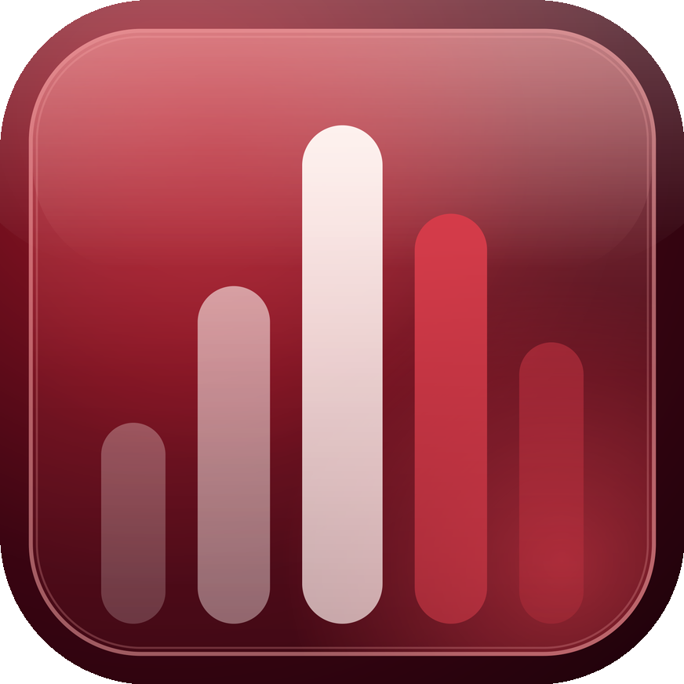
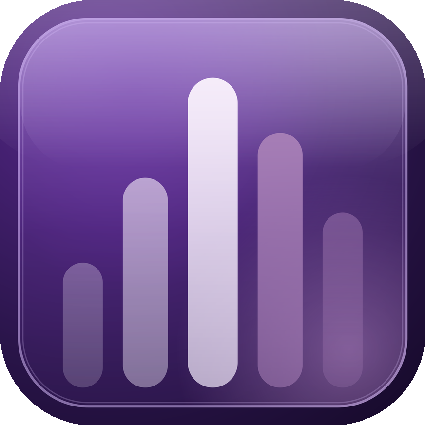

# DMusic

<p align="center">
  
  &nbsp;&nbsp;&nbsp;
  
</p>

<p align="center">
  <em>App musique iOS native avec Live Activity custom au design glassmorphism.</em>
</p>

Lit des fichiers audio locaux et streame depuis n'importe quelle URL YouTube/SoundCloud
via un backend yt-dlp en local. Deux thèmes (Crimson Night / Violet Dusk), icône d'app
dynamique selon le thème, controles lock screen entièrement custom (pas de player Apple).

## Fonctionnalités

- **Lecture locale** — import via `expo-document-picker` + `expo-media-library`,
  persistance SQLite (`expo-sqlite`)
- **Mode lien** — colle une URL YouTube/SoundCloud, le backend résout via yt-dlp
  et retourne un manifest audio + waveform pré-calculée
- **Live Activity custom** — bannière glassmorphism sur l'écran verrouillé avec
  artwork, titre, waveform 56-bars tactile pour seek, boutons play/pause/replay
  via App Intents (iOS 17+). Aucune dépendance au lecteur Apple standard.
- **Alternate app icons** — l'icône de l'app sur l'écran d'accueil change quand
  tu switches de palette dans les Settings
- **Thèmes** — Crimson Night (rouge `#ad2831`) / Violet Dusk (violet `#a149e0`),
  persistés en SQLite
- **Background audio** — `react-native-track-player` avec capabilities vidées
  pour qu'aucun control system Apple ne s'affiche

## Stack

- **Frontend** : Expo SDK 54, React Native 0.81, TypeScript, Zustand, expo-router v6
- **Audio** : `react-native-track-player` 4.x (avec `MPNowPlayingInfoCenter` /
  `MPRemoteCommandCenter` neutralisés via timer 250ms côté natif pour cacher
  le player Apple par défaut)
- **Live Activity** : `ActivityKit` + `WidgetKit` + `App Intents` (iOS 17+),
  config via `@bacons/apple-targets` qui génère le widget extension target
- **Module natif custom** (`modules/dmusic-activity`) — Expo Module qui expose
  `startActivity`, `updateActivity`, `endActivity`, `setAppIcon`, et écoute les
  intents Live Activity via App Group UserDefaults
- **Backend** : FastAPI + yt-dlp (Python), tourne en local sur `:8787`

## Structure

```
app/                              expo-router (UI)
├── _layout.tsx                   root provider
├── onboarding.tsx
├── (tabs)/
│   ├── library.tsx               bibliothèque + now-playing
│   ├── player.tsx                player plein écran
│   └── links.tsx                 mode URL
├── playlists/[id].tsx
├── queue.tsx, search.tsx, settings.tsx, ...

src/
├── theme/                        palettes + ThemeContext
├── components/                   MiniPlayer, Cover, Sheet, ...
├── store/playerStore.ts          Zustand (état lecture + Live Activity)
└── services/
    ├── AudioService.ts           wrapper RNTP
    ├── PlaybackService.ts        handlers RemotePlay/Pause/Seek
    ├── Extractor.ts              client backend yt-dlp
    └── Storage.ts                expo-sqlite

modules/dmusic-activity/          Expo Module natif (Swift)
├── ios/DmusicActivityModule.swift  ActivityKit bridge + setAppIcon
└── index.ts                       wrapper TS

targets/dmusicwidget/             Widget Extension iOS (via @bacons/apple-targets)
├── DMusicLiveActivity.swift      UI SwiftUI glassmorphism
├── DMusicAttributes.swift        ActivityAttributes
├── DMusicIconData.swift          icônes embeddées en base64
├── MusicIntents.swift            App Intents play/pause/seek
└── expo-target.config.js

plugins/withAlternateIcons.js     config plugin custom (alternate app icons)
backend/                          FastAPI + yt-dlp
```

## Installation

Tutoriel pas à pas pour faire tourner DMusic sur ton iPhone.

### Prérequis

- **Node.js 20+** et **npm**
- **Python 3.11+** (pour le backend)
- **Compte Apple Developer** (gratuit suffit pour un dev build sur ton propre iPhone)
- **iPhone iOS 17+** (App Intents requis pour les boutons Live Activity)
- Pas besoin de Mac/Xcode — le build se fait dans le cloud via EAS

### 1. Cloner le repo

```bash
git clone https://github.com/Djibzi/dmusic.git
cd dmusic
```

### 2. Installer les dépendances frontend

```bash
npm install
```

Sur Windows, le `.npmrc` à la racine active `legacy-peer-deps=true` pour gérer
les conflits de peer deps avec RNTP/Reanimated. Sinon ajoute le flag manuellement.

### 3. Lancer le backend yt-dlp (mode lien)

Dans un terminal séparé :

```bash
cd backend
python -m venv .venv
# Windows :
.venv\Scripts\activate
# macOS/Linux :
source .venv/bin/activate

pip install -r requirements.txt
uvicorn main:app --host 0.0.0.0 --port 8787
```

Le backend tourne maintenant sur `http://<ton-ip-locale>:8787`. Trouve ton IP avec
`ipconfig` (Windows) ou `ifconfig` (macOS/Linux), par exemple `192.168.1.42`.

### 4. Pointer l'app vers le backend

Édite [src/services/Extractor.ts](src/services/Extractor.ts) et remplace l'IP par
défaut par celle de ta machine. Ton iPhone et ton ordi doivent être sur le même WiFi.

### 5. Setup Apple Developer (côté Apple)

Sur le portail [developer.apple.com](https://developer.apple.com) :

1. Créer un App Group : `group.com.dmusic.app`
2. Créer deux App IDs et y associer le group :
   - `com.dmusic.app` (app principale)
   - `com.dmusic.app.widget` (widget extension)
3. Activer le capability **Live Activities** dans l'App ID de l'app principale

(Si tu utilises un bundle ID différent, change-le dans [app.json](app.json) et
[targets/dmusicwidget/expo-target.config.js](targets/dmusicwidget/expo-target.config.js).)

### 6. Installer EAS CLI et se connecter

```bash
npm install -g eas-cli
eas login
```

### 7. Build le dev client iOS

```bash
eas build --platform ios --profile development
```

Le build prend ~15min sur les serveurs Expo. Une fois prêt, EAS te donne un lien
d'installation (ou un QR code) — ouvre-le sur ton iPhone, accepte le profil de
provisioning dans Réglages → Général → VPN et gestion de l'appareil, et l'app
s'installe.

### 8. Lancer Metro

Dans le dossier du projet :

```bash
npx expo start --dev-client
```

Ouvre l'app sur ton iPhone — elle se connecte automatiquement à Metro et
recharge le JS sans rebuild natif. Tu peux maintenant éditer le code TS et
voir les changements instantanément.

> **Note** : un nouveau dev build EAS n'est nécessaire que si tu modifies du code
> natif Swift, le `app.json`, ou les configs de plugin.

## Architecture Live Activity

Le flux d'un click bouton sur le Live Activity :

```
User tap bouton lock screen
  ↓
PlayPauseIntent.perform()  (App Intent dans le widget process)
  ↓
écrit timestamp dans App Group UserDefaults
  ↓
Timer 250ms côté app principal (DmusicActivityModule) détecte le nouveau ts
  ↓
sendEvent("onAction", { action: "playPause" })
  ↓
JS : playerStore listener → toggle()
  ↓
RNTP play/pause + LiveActivity.updateActivity(state) → SwiftUI re-render
```

Le timer côté app sert aussi à **neutraliser le player Apple natif** :
toutes les 250ms, on vide `MPNowPlayingInfoCenter.nowPlayingInfo` et on retire
les targets de toutes les `MPRemoteCommand`. C'est la seule façon trouvée pour
empêcher RNTP/SwiftAudioEx d'afficher la bande "Now Playing" Apple sur le lock
screen — elle apparaîtrait au-dessus de notre Live Activity sinon.

## Limitations connues

- **Popup iOS au changement d'icône** — `setAlternateIconName` déclenche une
  alerte système "DMusic souhaite changer d'icône" non-supprimable (limitation
  Apple, valable pour toutes les apps App Store)
- **Live Activity ne survit pas à un force-quit** — limitation Apple. On
  termine proprement les activités via `UIApplication.willTerminateNotification`
  et on configure un `staleDate` à 30s comme fallback.
- **Backend en local uniquement** — yt-dlp bouge trop souvent pour déployer en
  prod sans CI de mise à jour. Le déploiement Fly.io est documenté mais pas actif.
